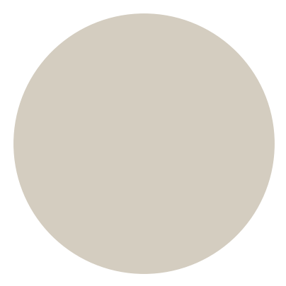
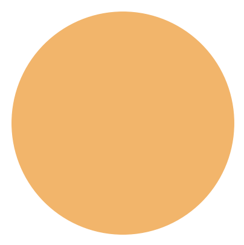
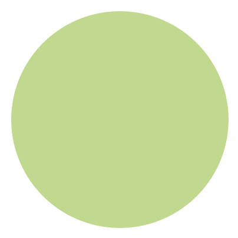
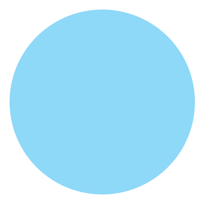
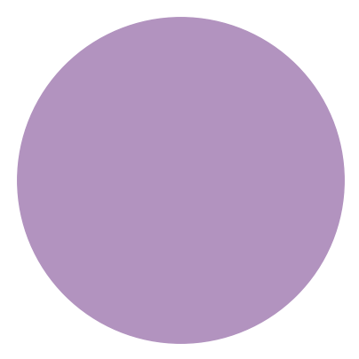
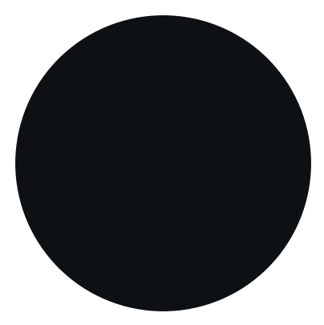
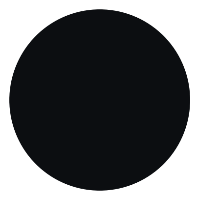

# Fandango
Minimal distractions colorscheme.
Fandango is a velvety black color scheme. Its objective is to be soothing by diluting unncessary clutter such as UI and comments as to reduce visual strain. 
To fade rather than pop.
It is perfect for coding, terminal UIs and dark mode design.

## Palette

| Patch | Color Name | HEX | RGB | HSL |
| --- | --- | --- | --- | --- |
|  | foreground | #D4cDc0ff | rgb(212, 205, 192) | hsl(39, 19%, 79%) |
|  | salmon | #f2856dff | rgb(242, 133, 109) | hsl(11, 84%, 69%) |
|  | yellow | #f2b56bff | rgb(242, 181, 107) | hsl(33, 84%, 68%) |
|  | pistachio | #c1d98fff | rgb(193, 217, 143) | hsl(79, 49%, 71%) |
|  | azure | #8ed8f8ff | rgb(142, 216, 248) | hsl(198, 88%, 76%) |
|  | blue | #8ca7d7ff | rgb(140, 167, 215) | hsl(218, 48%, 70%) |
|  | violet | #b293bfff | rgb(178, 147, 191) | hsl(282, 26%, 66%) |
|  | highlight | #e7e8e9ff | rgb(231, 232, 233) | hsl(210, 4%, 91%) |
|  | text | #bbbbbbff | rgb(187, 187, 187) | hsl(0, 0%, 73%) |
|  | subtext | #87959bff | rgb(135, 149, 155) | hsl(198, 9%, 57%) |
|  | subdued | #536e7aff | rgb(83, 110, 122) | hsl(198, 19%, 40%) |
|  | very-subdued | #2e3c44ff | rgb(46, 60, 68) | hsl(202, 19%, 22%) |
|  | hover | #1c2329ff | rgb(28, 35, 41) | hsl(208, 19%, 14%) |
|  | surfaces | #13171bff | rgb(19, 23, 27) | hsl(210, 17%, 9%) |
|  | lines | #0e1114ff | rgb(14, 17, 20) | hsl(210, 18%, 7%) |
|  | shade | #0c0e11ff | rgb(12, 14, 17) | hsl(216, 17%, 6%) |
|  | base | #090a0dff | rgb(9, 10, 13) | hsl(225, 18%, 4%) |

