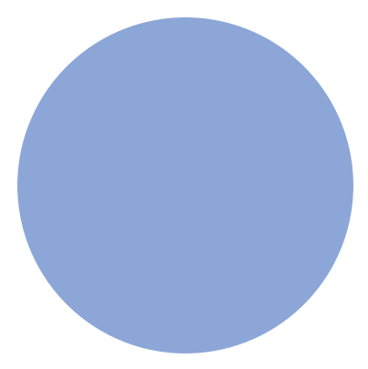
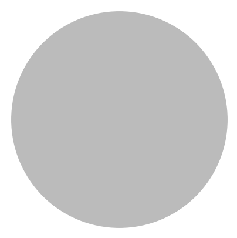
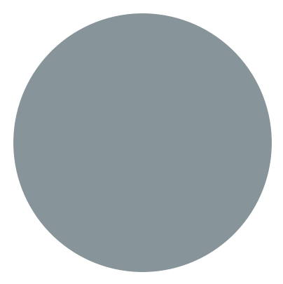
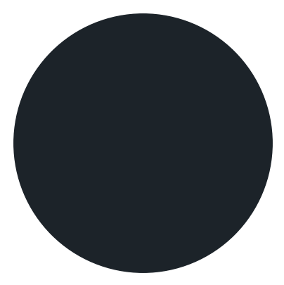

# Fandango

<p align="center">
	<a href="https://github.com/antonio-leitao/fandango/stargazers">
		
  </a>
	<a href="https://github.com/antonio-leitao/fandango/stargazers">
		
  </a>
	<a href="https://github.com/antonio-leitao/fandango/stargazers">
		
  </a>
	<a href="https://github.com/antonio-leitao/fandango/stargazers">
		
  </a>
</p>

Minimal distractions colorscheme.
Fandango is a velvety black color scheme. Its objective is to be soothing by diluting unncessary clutter such as UI and comments as to reduce visual strain.
To fade rather than pop.
It is perfect for coding, terminal UIs and dark mode design.

<p align="center">

</p>

## 🚀 Installation

You can install the Fandango theme without cloning the repository by running one of the commands below in your terminal. The script will automatically detect your supported applications and install the necessary theme files.

### One-Line Install

**Using `curl` (recommended):**

```bash
bash <(curl -sSL https://raw.githubusercontent.com/antonio-leitao/fandango/main/install.sh)
```

or using wget:

```bash
bash <(wget -qO- https://raw.githubusercontent.com/antonio-leitao/fandango/main/install.sh)
```

Note: The script will place the theme files in the correct directories and print the final steps needed to activate the theme for each application.

## Palette

<table>
    <thead>
        <tr>
            <th>Color</th>
            <th>Name</th>
            <th>HEX</th>
            <th>RGB</th>
            <th>HSL</th>
        </tr>
    </thead>
    <tbody>
        <tr>
            <td></td>
            <td>foreground</td>
            <td><code>#D4cDc0ff</code></td>
            <td><code>rgb(212, 205, 192)</code></td>
            <td><code>hsl(39, 19%, 79%)</code></td>
        </tr>
        <tr>
            <td></td>
            <td>salmon</td>
            <td><code>#f2856dff</code></td>
            <td><code>rgb(242, 133, 109)</code></td>
            <td><code>hsl(11, 84%, 69%)</code></td>
        </tr>
        <tr>
            <td></td>
            <td>yellow</td>
            <td><code>#f2b56bff</code></td>
            <td><code>rgb(242, 181, 107)</code></td>
            <td><code>hsl(33, 84%, 68%)</code></td>
        </tr>
        <tr>
            <td></td>
            <td>pistachio</td>
            <td><code>#c1d98fff</code></td>
            <td><code>rgb(193, 217, 143)</code></td>
            <td><code>hsl(79, 49%, 71%)</code></td>
        </tr>
        <tr>
            <td></td>
            <td>azure</td>
            <td><code>#8ed8f8ff</code></td>
            <td><code>rgb(142, 216, 248)</code></td>
            <td><code>hsl(198, 88%, 76%)</code></td>
        </tr>
        <tr>
            <td></td>
            <td>blue</td>
            <td><code>#8ca7d7ff</code></td>
            <td><code>rgb(140, 167, 215)</code></td>
            <td><code>hsl(218, 48%, 70%)</code></td>
        </tr>
        <tr>
            <td></td>
            <td>violet</td>
            <td><code>#b293bfff</code></td>
            <td><code>rgb(178, 147, 191)</code></td>
            <td><code>hsl(282, 26%, 66%)</code></td>
        </tr>
    <tr>
		<td></td>
		<td>highlight</td>
		<td><code>#e7e8e9</code></td>
		<td><code>rgb(231, 232, 233)</code></td>
		<td><code>hsl(210, 4%, 91%)</code></td>
	</tr>
	<tr>
		<td></td>
		<td>text</td>
		<td><code>#bbbbbb</code></td>
		<td><code>rgb(187, 187, 187)</code></td>
		<td><code>hsl(0, 0%, 73%)</code></td>
	</tr>
	<tr>
		<td></td>
		<td>subtext</td>
		<td><code>#87959b</code></td>
		<td><code>rgb(135, 149, 155)</code></td>
		<td><code>hsl(198, 9%, 57%)</code></td>
	</tr>
	<tr>
		<td></td>
		<td>subdued</td>
		<td><code>#536e7a</code></td>
		<td><code>rgb(83, 110, 122)</code></td>
		<td><code>hsl(198, 19%, 40%)</code></td>
	</tr>
	<tr>
		<td></td>
		<td>muted</td>
		<td><code>#2e3c44</code></td>
		<td><code>rgb(46, 60, 68)</code></td>
		<td><code>hsl(202, 19%, 22%)</code></td>
	</tr>
	<tr>
		<td></td>
		<td>hover</td>
		<td><code>#1c2329</code></td>
		<td><code>rgb(28, 35, 41)</code></td>
		<td><code>hsl(208, 19%, 14%)</code></td>
	</tr>
	<tr>
		<td></td>
		<td>surfaces</td>
		<td><code>#13171bff</code></td>
		<td><code>rgb(19, 23, 27)</code></td>
		<td><code>hsl(210, 17%, 9%)</code></td>
	</tr>
	<tr>
		<td></td>
		<td>lines</td>
		<td><code>#0e1114ff</code></td>
		<td><code>rgb(14, 17, 20)</code></td>
		<td><code>hsl(210, 18%, 7%)</code></td>
	</tr>
	<tr>
		<td></td>
		<td>shade</td>
		<td><code>#0c0e11ff</code></td>
		<td><code>rgb(12, 14, 17)</code></td>
		<td><code>hsl(216, 17%, 6%)</code></td>
	</tr>
	<tr>
		<td></td>
		<td>base</td>
		<td><code>#090a0dff</code></td>
		<td><code>rgb(9, 10, 13)</code></td>
		<td><code>hsl(225, 18%, 4%)</code></td>
	</tr>
</table>
